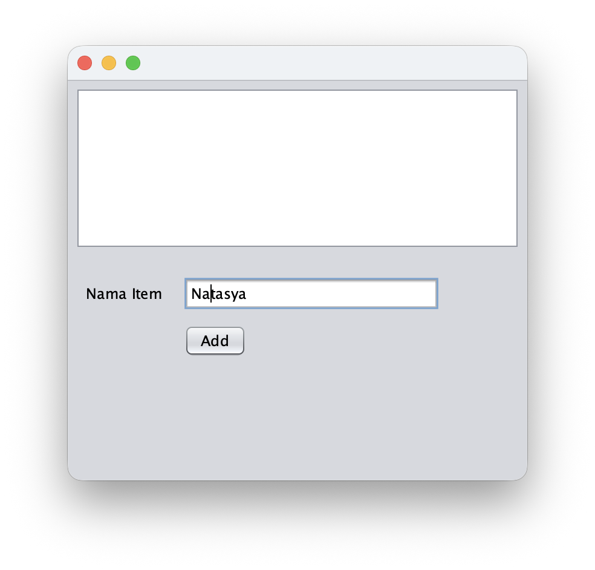
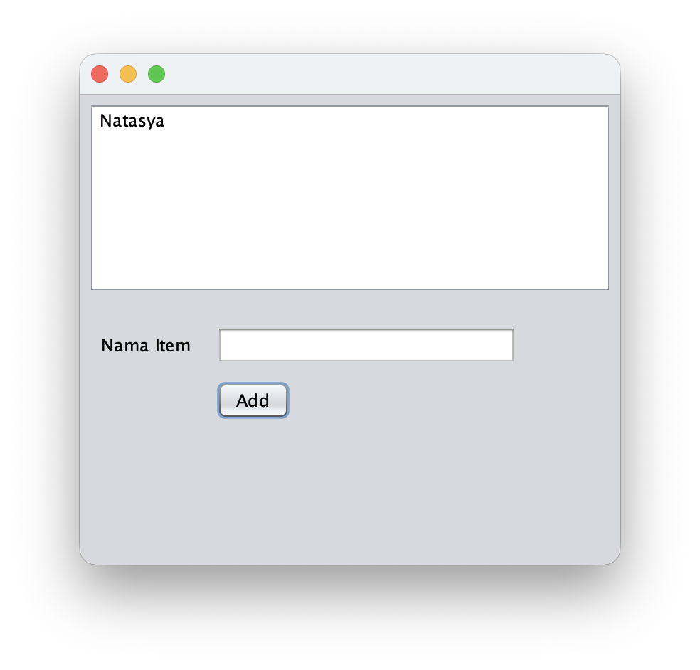
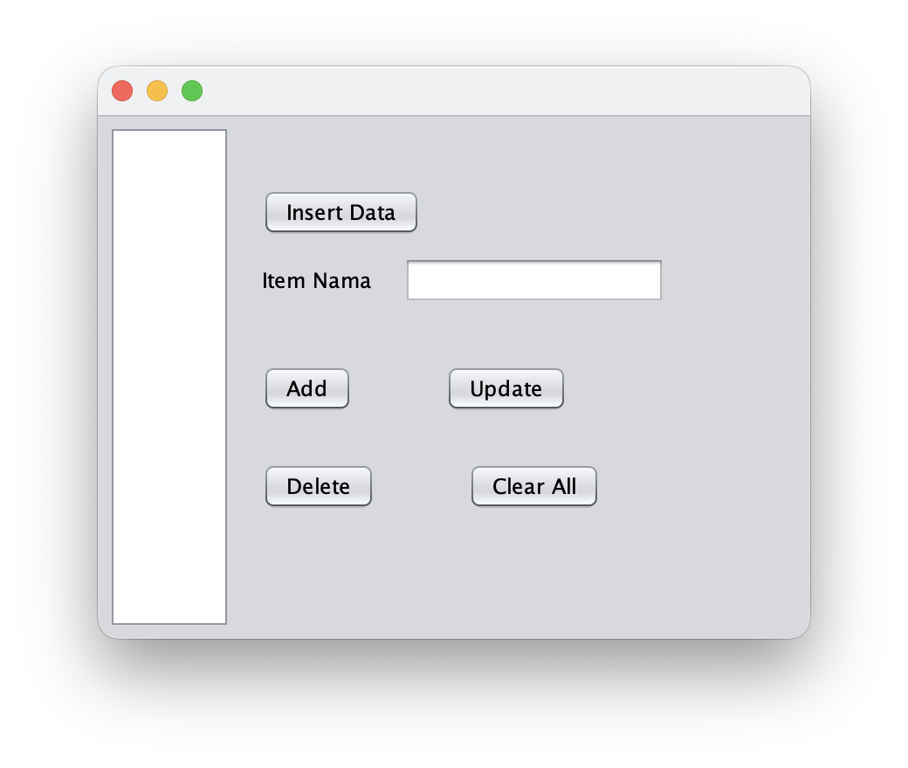
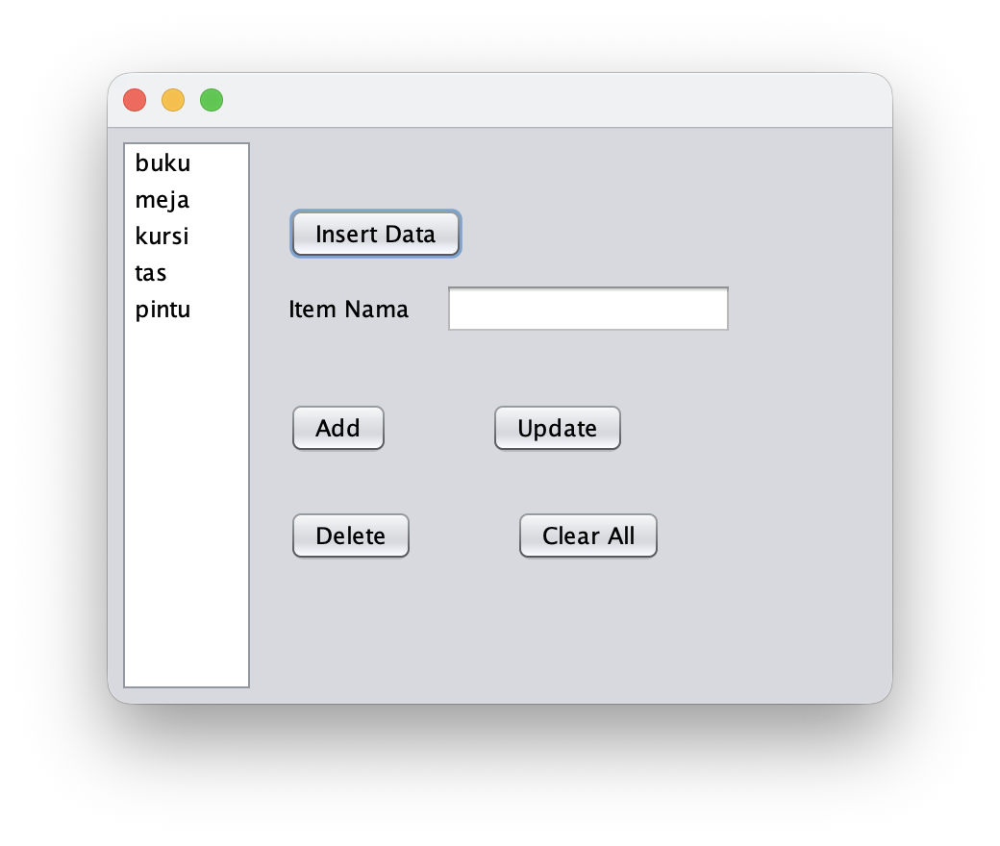
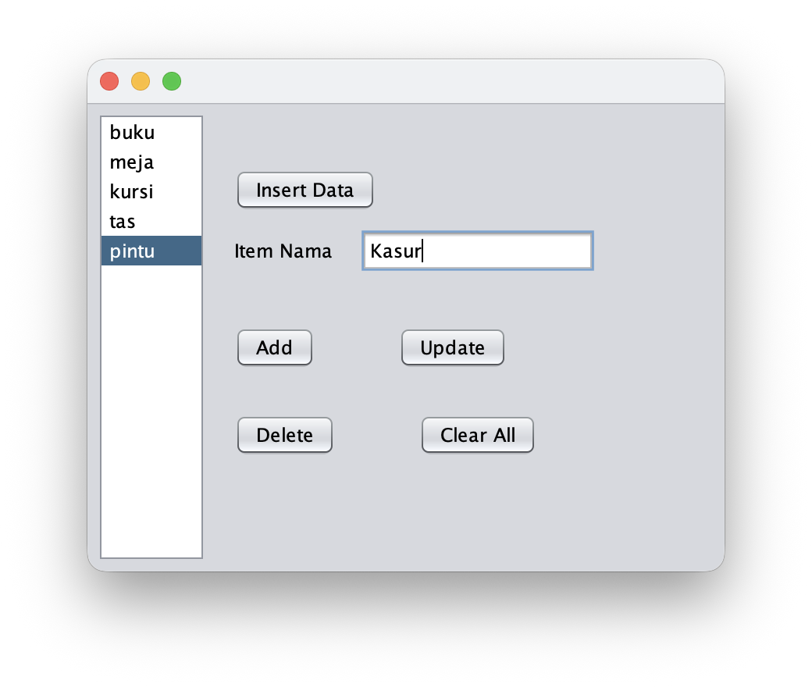
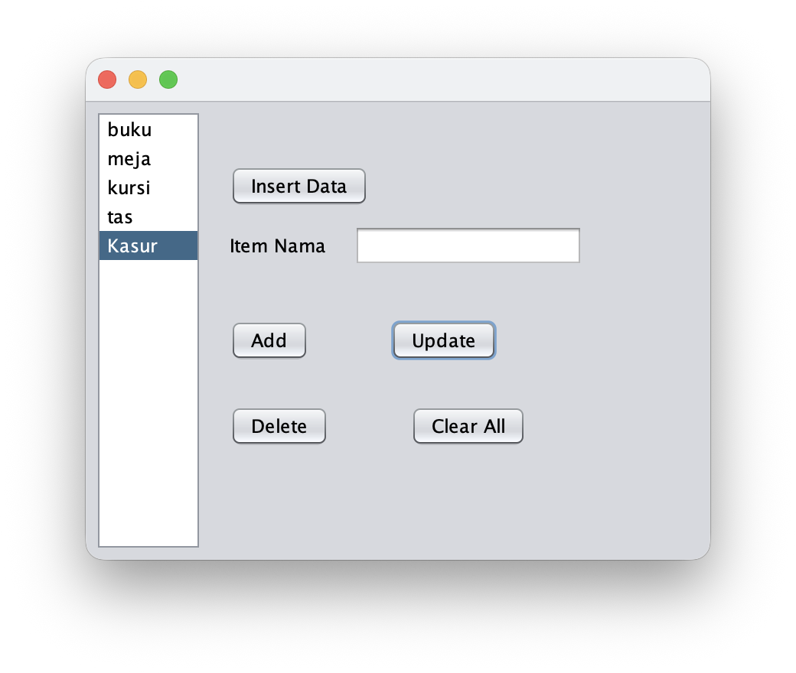

## Hasil Tampilan Proyek

### Proyek 1

Proyek 1 menampilkan form sederhana untuk menambahkan item ke dalam `JList`.

  <table>
    <tr>
      <td align="center">
        <strong>Before</strong> 
        
      </td>
      <td align="center">
        <strong>After</strong> 
        
      </td>
    </tr>
  </table>

### Proyek 2

Proyek 2 menambahkan fitur pengelolaan data seperti **Insert Data**, **Add**, **Update**, **Delete**, dan **Clear All**.

  <table>
    <tr>
      <td align="center">
        <strong>Before Insert</strong> 
        
      </td>
      <td align="center">
        <strong>After Insert</strong> 
        
      </td>
    </tr>
  </table>

  <table>
    <tr>
      <td align="center">
        <strong>Before Update</strong> 
        
      </td>
      <td align="center">
        <strong>After Update</strong> 
        
      </td>
    </tr>
  </table>

### Proyek 3

Proyek 3 menggunakan `ArrayList` untuk menyimpan data dari `JList` dan menampilkan jumlah data yang tersimpan.

  

### Proyek 4

Proyek 4 mengimplementasikan penyimpanan data menggunakan `List`, `Set`, dan `Map`.

  

## Fitur Singkat

|  Proyek  |                             Fitur Utama                            |
|----------|--------------------------------------------------------------------|
| Proyek 1 | Menambahkan item ke `JList`                                        |
| Proyek 2 | Insert, add, update, delete, dan clear data                        |
| Proyek 3 | Menyimpan data ke `ArrayList` dan menampilkan jumlah data          |
| Proyek 4 | Menyimpan dan menampilkan ulang data dari `List`, `Set`, dan `Map` |
