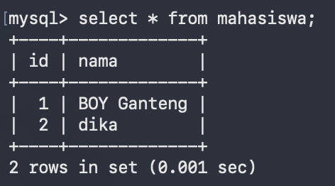
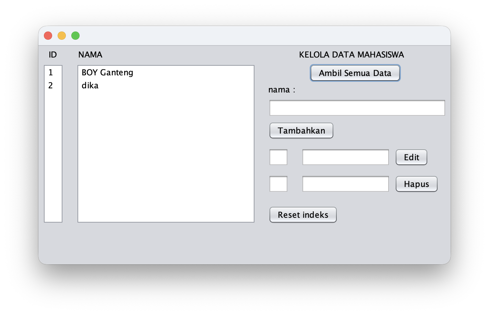
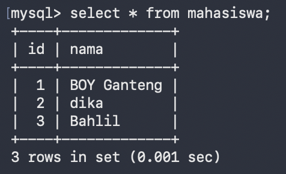
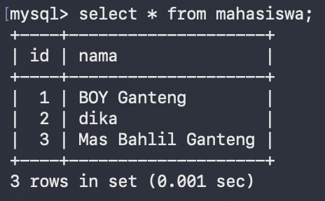
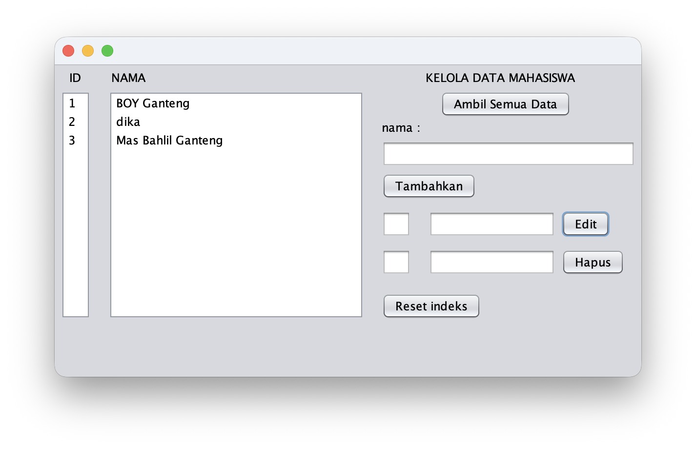
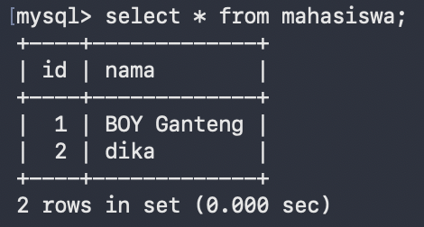
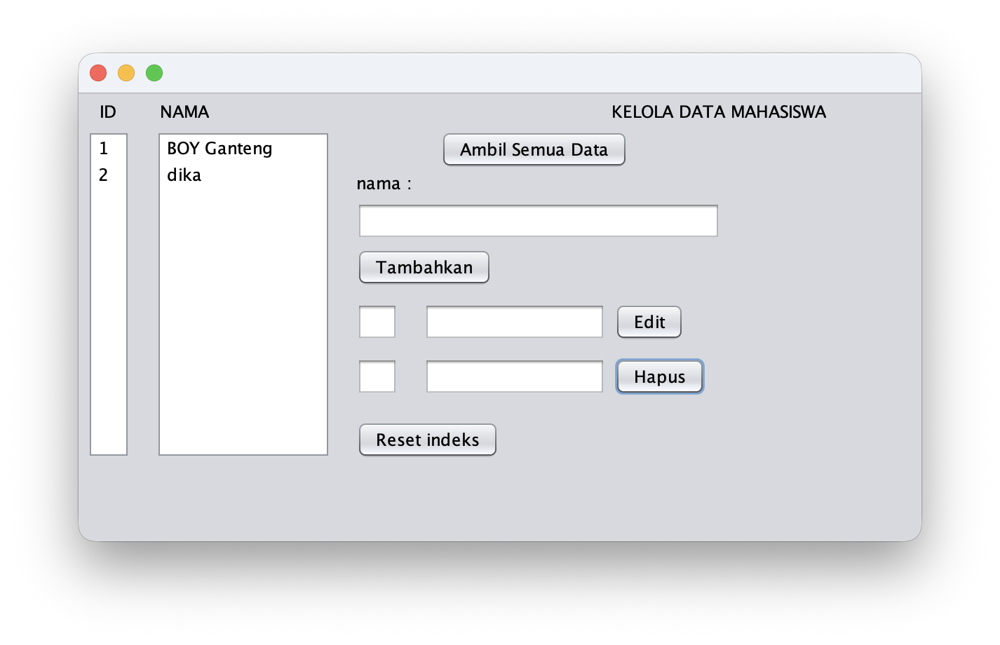
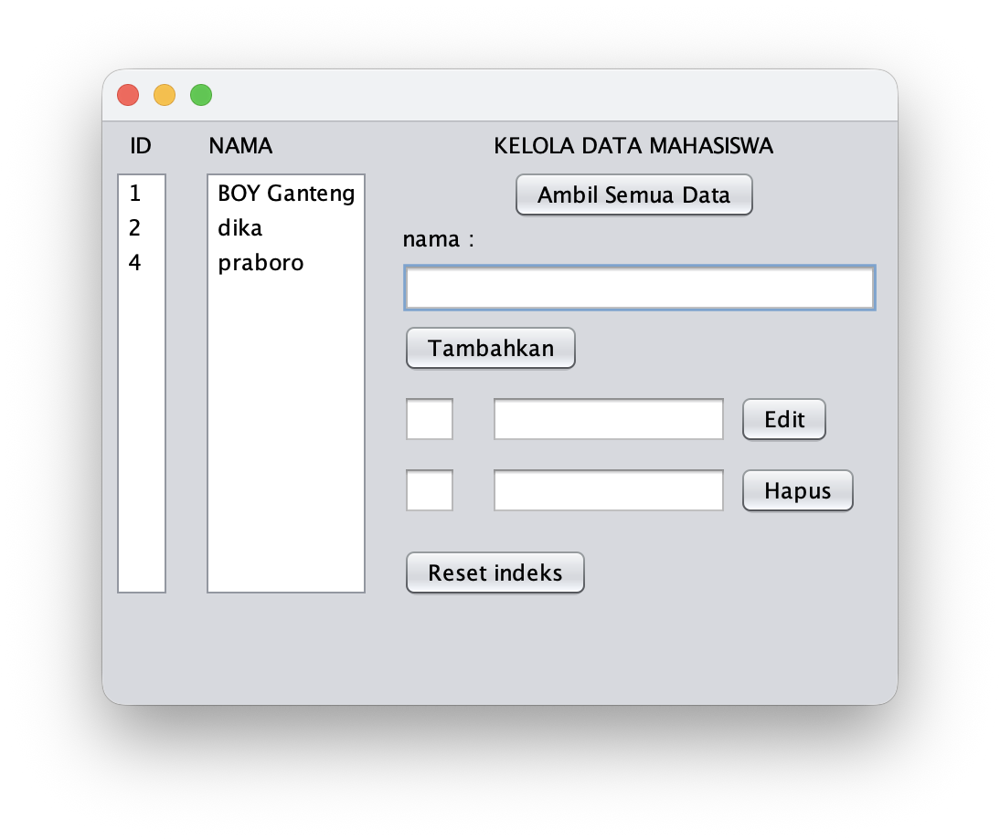
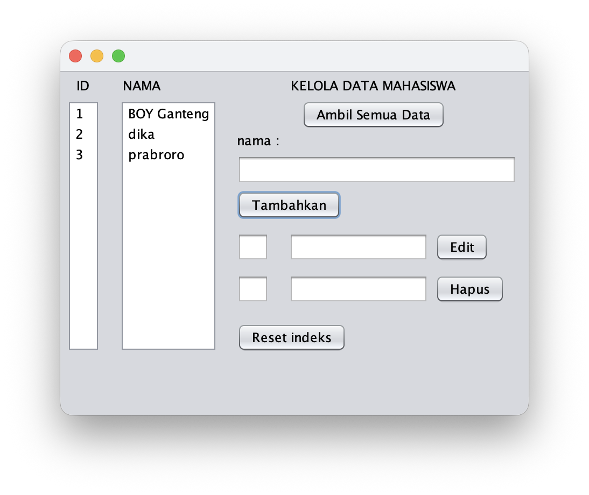

## Hasil Tampilan Praktikum

### Praktikum 11 B

  <table>
    <tr>
      <td align="center">
        <strong>BD Awal</strong> 
        
      </td>
      <td align="center">
        <strong>GUI Awal</strong> 
        
      </td>
    </tr>
    <tr>
      <td align="center">
        <strong>DB Tambah Data</strong> 
        
      </td>
      <td align="center">
        <strong>GUI Tambah Data</strong> 
        
      </td>
    </tr>
    <tr>
      <td align="center">
        <strong>DB Edit Data</strong> 
        
      </td>
      <td align="center">
        <strong>GUI Edit Data</strong> 
        
      </td>
    </tr>
    <tr>
      <td align="center">
        <strong>DB Hapus Data</strong> 
        
      </td>
      <td align="center">
        <strong>GUI Hapus Data</strong> 
        
      </td>
    </tr>
    <tr>
      <td align="center">
        <strong>Sebelum Reset Indeks</strong> 
        
      </td>
      <td align="center">
        <strong>Sesudah Reset Indeks</strong> 
        
      </td>
    </tr>
  </table>

